**[ Français ](#french) [ English ](#english)**

---

<a name="english"></a>
#  Java Koans for the FRC

## Table of content

- [Overview](#overview)
- [Getting Started](#getting-started)
- [Learning to code with the Java Koans for the FRC](#learning-to-code-with-the-java-koans-for-the-frc)
- [Java cheat sheet](#java-cheat-sheet)
- [And then what?](#and-then-what)
- [Mentors](#mentors)
- [Credits](#credits)
- [License](#license)

## Overview

Java Koans for the FRC is an interactive, step by step, course to teach Java to students engaged in the [First Robotics Competition](https://www.firstinspires.org/robotics/frc). It requires no previous experience in programming. It does not intend to teach the entirety of the Java language, but rather most of the fundamentals required to start learning how to program a FRC robot.

## Getting Started

You will need to install [WPILib](https://docs.wpilib.org/en/stable/docs/zero-to-robot/step-2/wpilib-setup.html) first to run the Java Koans for the FRC.

Once installed, download the [latest release](https://github.com/jletroui/FrcJavaKoans/releases/download/v1.0/FrcJavaKoans.zip) of the Java Koans.

Then, extract it somewhere on your computer. Go to the folder where you have downloaded the koans, righ-click on the koans zip file, and choose 'Extract All'. Choose your destination folder, for example, a `/src` folder within your `Documents` folder.

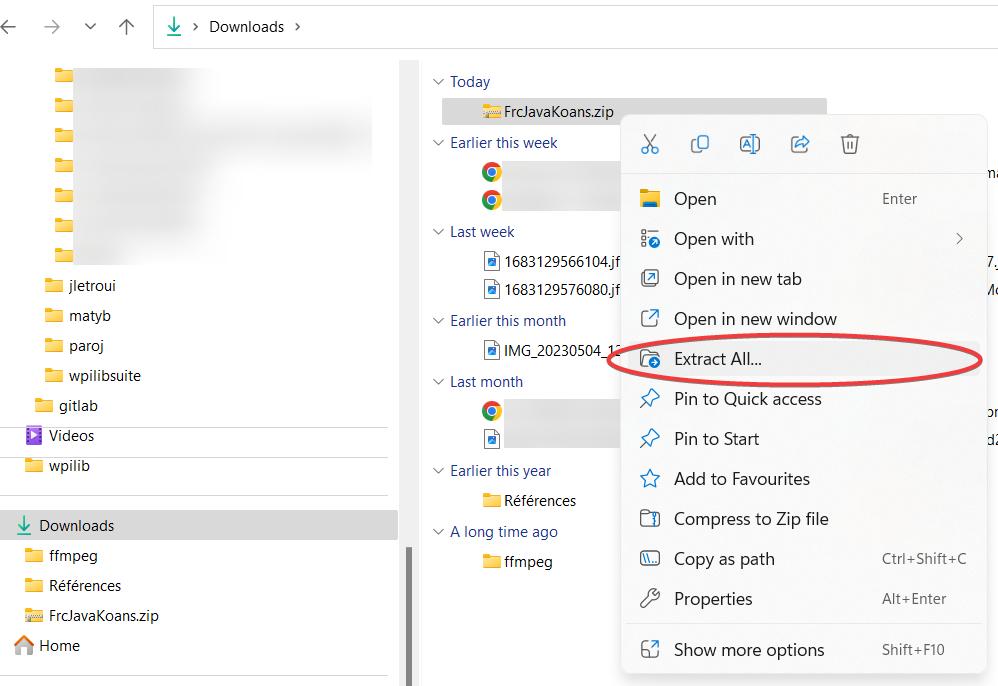
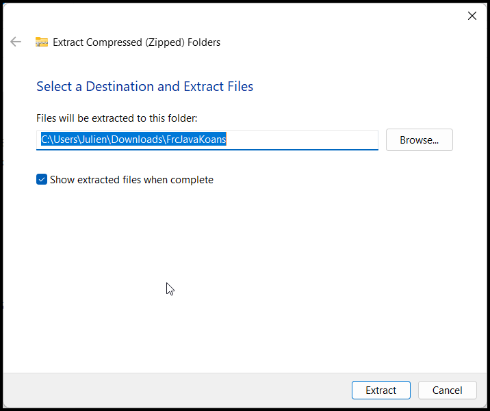

Then, open WPILib VSCode:

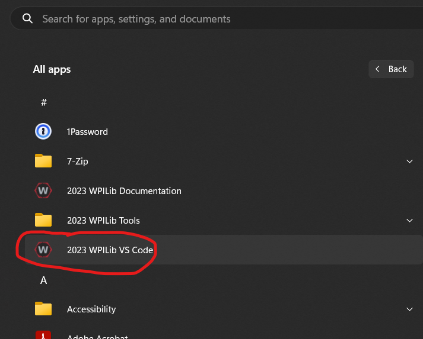

And open the folder in which you extracted the koans (for example, `C:\Users\Jane\Documents\src\FrcJavaKoans`):

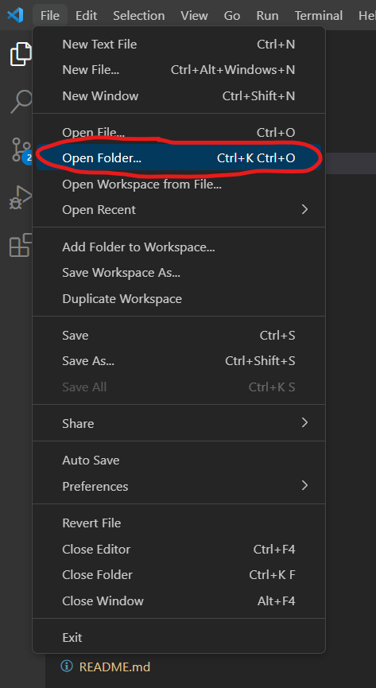

Note: VS Code will ask you if you trust the code within the folder. You'll have to answer 'yes' to proceed.

You are ready to go!

## Learning to code with the Java Koans for the FRC

A koan is a challenge a zen master is throwing at you to help you learn something. Here, your mission is to solve koans which will help you learn about programming in Java.

### Ask the master for koans

When you open the Java Koans for the FRC in VS Code, you should see something similar to this:

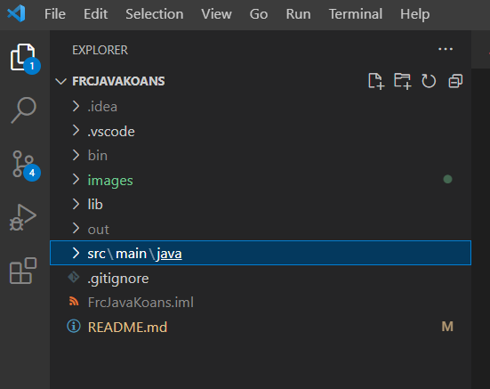

Expand the `src` folder, then right click on the file `src\main\java\EnglishPathToEnlightment.java` and choose `Run Java`:

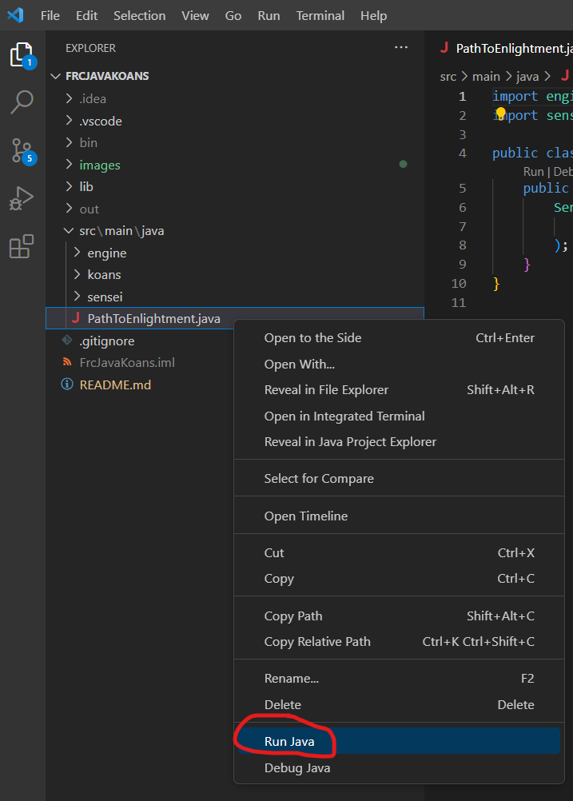

Note: Windows Defender might ask you to authorize VS Code to use the network. You'll have to authorize it.

This will open what is called a _terminal_ at the bottom of the VS Code window and run the Java Koans for the FRC. Ignore all the cryptic text generated by VS Code for now and focus on this part:

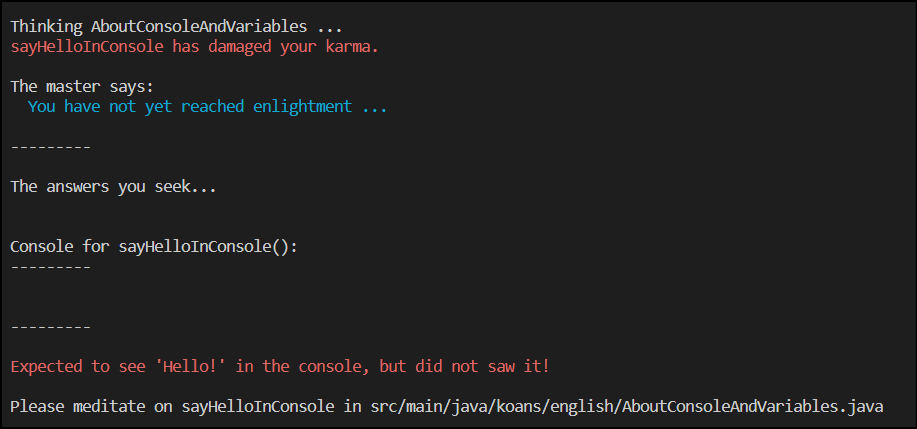

The master of the Java Koans is telling you a lot of things at once, so let's decompose a bit.

First, it tells you that it is trying to teach you  `AboutConsoleAndVariables`. Then it tells you that you did not complete the `AboutConsoleAndVariables.sayHelloInConsole` koan. Which is normal, because you have not even started yet! Then it shows a mysterious `Console` box, which we will ignore for now. At the very bottom, it tells you you can look for `sayHelloInConsole` in the `src/main/java/koans/english/AboutConsoleAndVariables.java` file.

### Opening the koan file

Open that file in VS Code:

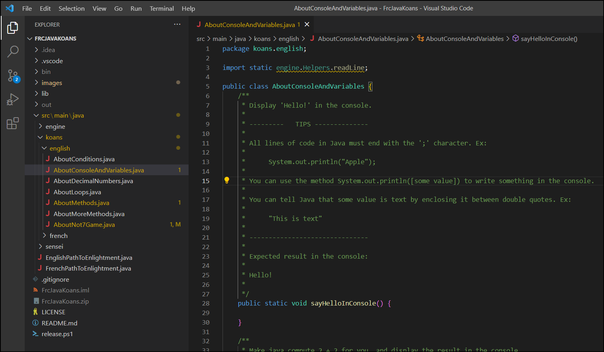

Wow, there is a lot going on! In order to understand what is all of this, we need to learn a few things about Java.

### Java files

All the code written in Java must go in files with the `.java` extension. The content of these files follow a pretty strict organisation. First at the top, there are a few lines helping Java knowing which other files it will need to get in order to make sense of this one:

```java
package koans.english;

import static engine.Helpers.readLine;
```

We will not explain the details of these lines for now and ignore them. Don't worry, when done with the koans, you will understand them!

### The class

Next in the file, we can see this:

```java
public class AboutConsoleAndVariables {
```

This tells Java that we are creating a `AboutConsoleAndVariables` class. All the bits of code in Java are organised in classes. You can think of a class like a drawer or a shelf containing bits of code. You can only have one class in a java file, and the name of the file must be the name of the class, with the `.java` extension. This is why the file we are looking at is named `AboutConsoleAndVariables.java`. All the code of a class is contained between the opening `{` and the closing `}` at the bottom of the file.

Note: everywhere in Java where you will need to 'enclose' a bit of code, we will use an opening `{` and a closing `}`. This will tell Java that everything between those curly brackets are belonging to the same thing.

### The koan instructions

Next, we can see these lines, colored in green:

```java
    /**
     * Display 'Hello!' in the console.
     * 
     * ---------   TIPS --------------
     * 
     * All lines of code in Java must end with the ';' character. Ex:
     * 
     * System.out.println("Apple");
     * 
     * You can use the method System.out.println([some value]) to write something in the console.
     * 
     * You can tell Java that some value is text by enclosing it between double quotes. Ex:
     * 
     * "This is text"
     * 
     * -------------------------------
     * 
     * Expected result in the console:
     * 
     * Hello!
     * 
     */
```

These lines are forming what's called a 'comment'. All the text between a `/*` and a `*/` is a comment. A comment is a piece of information that is ignored by Java. It is not code. It is very useful for documenting your code while you are writing Java. The master is putting each Koan's instructions for you in such a comment. You can find the goal of the koan at the top of each such comment: `Display 'Hello!' in the console.`. The console is the simplest way for a Java program to communicate with you by displaying simple text in a terminal. Remember what was displayed when running the Koans? You saw this bit:

```
Console:
---------


---------
```

This is where the text will appear when you will program something displaying text in the console.

After the goal of the koan, the comment goes on with tips on how to solve the koan. For example, it is telling you to use `System.out.println([some value])`. Note: when you see square brackets '['  and ']' in the master's instructions, it is not something to type in directly, but rather it is a placeholder for you to type something else.

Finally, the last section of the comment is showing you what result your code is expected to produce.

When trying to solve a koan, take your time to understand all the information that is given to you to successfully solve it.

### The koan method

Finally, we arrive at the part of the file where you will be able to code in Java! In Java all the code must be part of a "program chunk" called a method. A method is really nothing else than a mini-program. Here is the method of the first koan:

```java
    public static void sayHelloInConsole() {

    }
```

We will ignore the `public static void` part for now. What comes next is the name of the method: `sayHelloInConsole`. All the code chunks in Java have names, allowing to refer to it later, if we want to run that piece of code. Then comes parentheses: `()`. This is basically telling Java that `sayHelloInConsole` is a method. And at last, the opening `{` and closing `}`. All the code you will write will have to go in between those 2 curly brackets, and nowhere else. If you write code outside of the curly brackets of a method, Java will show you an error.

So let's try so solve this first koan. To do it, we have to display "Hello!" in the console. The first tip for doing so is:

```
     * All lines of code in Java must end with the ';' character.
```

Ok, so we can at least put a ';' at the end of our line, so we don't forget:

```java
    public static void sayHelloInConsole() {
        ;
    }
```

The next piece of tip is:

```
     * You can use the method System.out.println([some value]) to write something in the console.
```

So we know we should use this command, and find a way to replace `[some value]` by the _Hello!_ text later. Let's write down the command without the value for now:

```java
    public static void sayHelloInConsole() {
        System.out.println();
    }
```

Next the final tip is telling us how to write a text value:

```
     * You can tell Java that some value is text by enclosing it between double quotes.
```

Perfect! So let's place the value within the previous command:

```java
    public static void sayHelloInConsole() {
        System.out.println("Hello");
    }
```

### Running the koans again

Now that we think we completed the koan, let's ask the master what he thinks and see what happens. To run the koans, right-click on `EnglishPathToEnlightment.java` and choose `Run Java`. You should see this output:


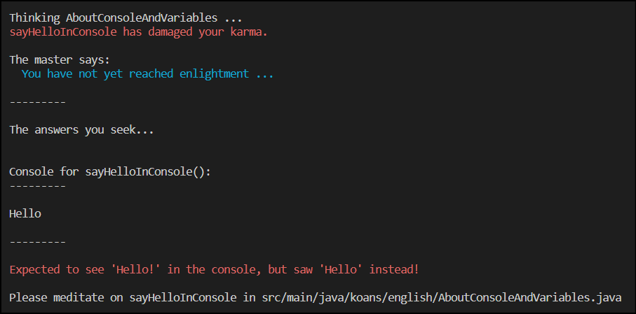


Oops, we made a mistake! The master was expecting us to display _Hello!_, but we forgot the exclamation mark. Let's fix it in `src/main/java/koans/english/AboutConsoleAndVariables.java`:

```java
    public static void sayHelloInConsole() {
        System.out.println("Hello!");
    }
```

And run the koans again:


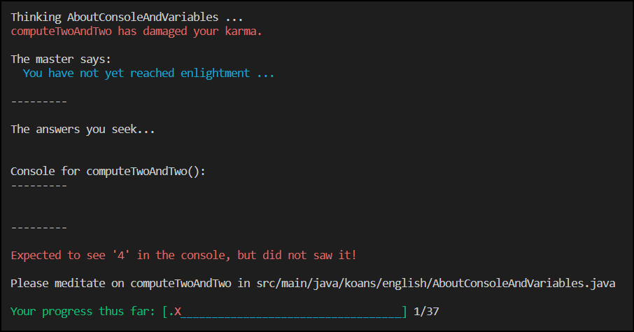


That's a completely different message! This is because we successfully completed the first koan! So our master is telling us about our progress and about the next koan.

Congratulations, you completed your first koan! You can now look at the next koan in the `src/main/java/koans/english/AboutConsoleAndVariables.java` file and try to figure out how to complete the next koan!

## Java cheat sheet

To help you remember the bits of Java syntax you are learning while completing your koans, you can print a copy of the [Java Cheat Sheet](./JavaCheatSheet.pdf).

## And then what?

After completing the koans, you are ready to learn how to program an actual robot. Mykah, from [team 9153 - Bearcat Robotics](https://sites.google.com/lincolnschoolscb.org/9153-bearcat-robotics/home), is maintaining a [wonderful compendium of FRC programming resources](https://docs.google.com/document/d/1jcBLAyJ3iTbsYSnWMVWqHaK8uywGTaTjF98eY_xxpl0/edit#heading=h.21bclvyus8vm) from which you can dig for your next steps.
<br/>

> Experience is the name everyone gives to their mistakes.

*Oscar Wilde*

## Mentors

This course intent to come batteries included, with 100% of the information needed by a motivated student to learn Java from Scratch without any other ressource at hand. However, it is best used with assisting mentors.

We have found that students learn faster if mentors are not giving solutions to students' issues, but instead ask them open questions about what they don't understand about the exercise instructions or displayed error. Programming is, most of the time, about figuring out what little detail have been overlooked. Thus, helping students to look for answers by themselves in the koans' text will help them become more autonomous faster when it will be time to program and debug a robot.

If you are interested in contributing, please take a look at [CONTRIBUTING.md](CONTRIBUTING.md) :)

## Credits

Created by a mentor from the [3550 Robotronix team](https://www.instagram.com/3550robotronix/) (Montréal, Canada).

Heavily inspired by the wonderful [Ruby Koans](https://www.rubykoans.com/).

Many thanks to early testers who gave me feedback: Andy, Noémie, Chenxin, and Dumitru.

## License

 This work is licensed under a [Creative Commons Attribution-ShareAlike 4.0 International License](https://creativecommons.org/licenses/by-sa/4.0/).

---
<a name="french"></a>
#  Koans Java pour la FRC

## Sommaire

- [Aperçu](#aperçu)
- [Comment démarrer](#comment-démarrer)
- [Apprendre à programmer avec les Koans Java pour la FRC](#apprendre-à-programmer-avec-les-koans-java-pour-la-frc)
- [Aide mémoire Java](#aide-mémoire-Java)
- [Et ensuite?](#et-ensuite)
- [Mentors](#mentors-fr)
- [Attributions et remerciements](#attributions-et-remerciements)
- [License](#license-fr)

## Aperçu

Les Koans Java pour la FRC forment un cours interactif, pas à pas, pour enseigner le Java à des élèves engagés dans la [Compétition Robotique First](https://www.firstinspires.org/robotics/frc). Il ne requiert aucune expérience préalable en programmation. L'intention n'est pas d'être un cours complet sur Java, mais plutôt d'apprendre juste ce qu'il faut des fondamentaux pour pouvoir commencer à apprendre à programmer un robot FRC avec WPILib.

## Comment démarrer

Si ce n'est déjà fait, tu vas devoir installer [WPILib](https://docs.wpilib.org/en/stable/docs/zero-to-robot/step-2/wpilib-setup.html) pour pouvoir exécuter les Koans Java pour la FRC.

Une fois installé, télécharge [la dernière version](https://github.com/jletroui/FrcJavaKoans/releases/download/v1.0/FrcJavaKoans.zip) des Koans Java.

Ensuite, décompresse les quelque part sur ton ordinateur. Pour ce faire, va dans le répertoire où tu as téléchargé les koans, clic-droit dessus, et choisis "Extraire Tout". Choisis un répertoire de destination, par exemple, un répertoire `/src` dans ton répertoire `Documents`.


Ensuite, ouvre le VSCode du WPILib:


Et ouvre le répertoire dans lequel tu as décompressé les Koans (par exemple: `C:\Users\Jane\Documents\src\FrcJavaKoans`)


Note: VS Code va te demander si tu fais confiance à ce code. Tu vas devoir répondre "oui".

Tu es maintenant prêt·e!

## Apprendre à programmer avec les Koans Java pour la FRC

Un koan est un défi lancé par un maître zen pour apprendre quelque chose du monde. Ici, ta mission est de résoudre les koans qui vont t'aider à apprendre à programmer en Java.

### Demande des koans au maître

Quand tu ouvre les Koans Java pour la FRC dans VS Code, tu devrais voir quelque chose de similaire à ceci:


Ouvre le répertoire `src`, puis fais un clic droit sur le fichier `src\main\java\EnglishPathToEnlightment.java` et choisis `Run Java`:

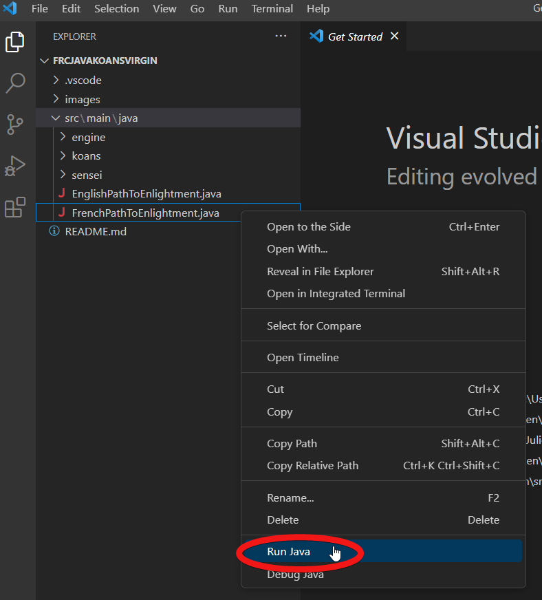

Note: Windows Defender va peut être te demander si tu autorise l'application à utiliser le réseau. Tu as alors besoin de l'autoriser.

Cela va ouvrir ce que l'on appelle un _terminal_ dans le bas de la fenêtre de VS Code, et exécuter les Koans Java pour la FRC. Ignore tout le texte cryptique généré par VS Code dans le terminal et concentre toi sur cette partie:

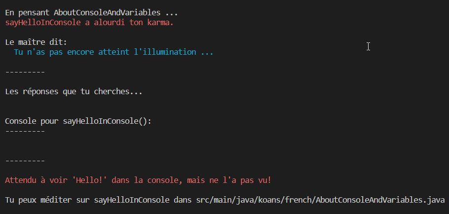

Le maître des Koans Java te dit beaucoup de choses d'un coup. Alors décomposons tout ça.

Tout d'abord, il te dit qu'il essaie de t'enseigner `AboutConsoleAndVariables`. Ensuite, il te dit que tu n'as pas complété le koan `AboutConsoleAndVariables.sayHelloInConsole`. Ce qui est normal, car tu n'a même pas encore commencé! Ensuite, il te montre une boîte étrange appelée `Console`, que l'on va ignorer pour le moment. Tout en bas,il te dit que tu peux chercher `sayHelloInConsole` dans le fichier `src/main/java/koans/english/AboutConsoleAndVariables.java`.

### Ouvrir le fichier du koan

Ouvre ce fichier dans VS Code:

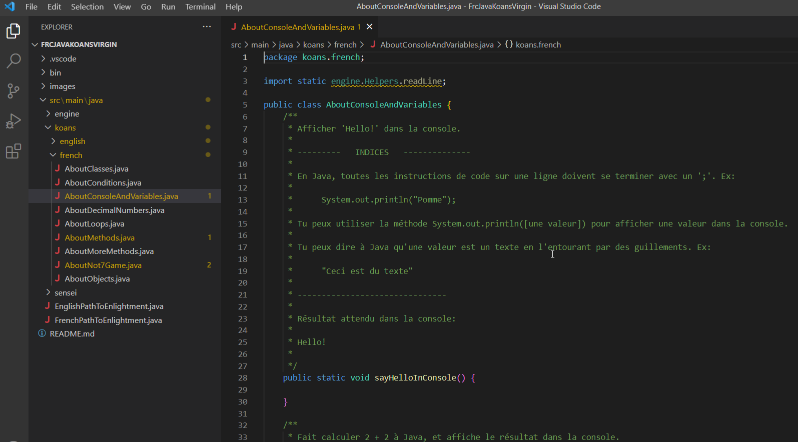

Wow, il y a beaucoup de choses là dedans! Pour comprendre tout ça, nous avons besoin d'apprendre quelques notions de Java.

### Fichiers Java

Tout le code écrit en Java doit aller dans des fichiers avec l'extension `.java`. Le contenu de ces fichiers suit une organisation stricte. D'abord, en haut, il y a plusieurs lignes qui aident Java à savoir quels sont les autres fichier dont il va avoir besoin pour comprendre celui-ci::

```java
package koans.french;

import static engine.Helpers.readLine;
```

Nous expliquerons en détails ces lignes plus tard, et allons les ignorer pour le moment. Ne t'inquiètes pas, quand tu auras fini avec les koans, tu vas les comprendre!

### La classe

Ensuite dans le fichier, nous pouvons voir ceci:

```java
public class AboutConsoleAndVariables {
```

Cela instruit Java que nous créons une classe `AboutConsoleAndVariables`. Tout le code Java est organisé en classes. Tu peux voir une classe comme un tiroir ou une étagère qui contient des morceaux de code. Tu peux seulement avoir une classe par fichier Java, et le nom du fichier doit correspondre au nom de la classe, avec l'extension `.java`. C'est pourquoi le fichier que nous regardons présentement est nommé `AboutConsoleAndVariables.java`.

Tout le code de la classe est compris entre l'accolade ouvrante `{` et la fermante `}` tout à la fin du fichier.

**Note**: en Java, partout où tu dois délimiter des morceaux de code, nous allons écrire ce code entre une accolade ouvrante `{` et une fermante `}`. Cela instruit Java que tout ce qu'il y a entre ces accolades appartient à la même chose.

### Les instructions du koan

Ensuite, nous pouvons voir ces lignes, en vert:

```java
    /**
     * Afficher 'Hello!' dans la console.
     * 
     * ---------   INDICES   --------------
     * 
     * En Java, toutes les instructions de code sur une ligne doivent se terminer avec un ';'. Ex:
     * 
     *      System.out.println("Pomme");
     * 
     * Tu peux utiliser la méthode System.out.println([une valeur]) pour afficher une valeur dans la console.
     * 
     * Tu peux dire à Java qu'une valeur est un texte en l'entourant par des guillemets. Ex:
     * 
     *      "Ceci est du texte"
     * 
     * -------------------------------
     * 
     * Résultat attendu dans la console:
     * 
     * Hello!
     * 
     */
```

Ces lignes forment ce qu'on appelle un 'commentaire'. Tout le texte vert entre `/**` et `*/` est un commentaire. Un commentaire est une information destinée à des humains, et est ignoré par Java. Ce n'est pas du code. C'est très utile pour documenter ton code quand tu écris du Java. Le maître se sert d'un de ces commentaires pour placer les instructions de chacun de ses koans.

Tu peux trouver l'objectif du koan en haut du commentaire: `Afficher 'Hello!' dans la console.`. La console est la façon la plus simple pour un programme Java d'afficher quelque chose dans un terminal. Tu te souviens de ce qui a été affiché lorsque tu as exécuté les koans? Tu as vu ce bout de texte:

```
Console:
---------


---------
```

C'est là que le texte que tu vas afficher dans la console va apparaître.

Après le but du koan, le maître te donne des indices pour résoudre le koan. Par exemple, il t'explique ici que tu peux utiliser l'instruction Java `System.out.println([une valeur])`.

**Note**: quand tu vois dans les instructions du maître des crochets '[' et ']', ce n'est pas pour taper dans le programme les crochets et ce qu'il y a entre eux. En effet, c'est un moyen pour désigner un espace à remplacer par quelque chose d'autre.

Finalement, la dernière section des instructions te montre quel résultat ton code est supposé produire. Attention! Les petits détails comme la grammaire et les espaces sont importants!

Lorsque tu essaies de résoudre un koan, prends ton temps pour comprendre toute l'information qui t'es donnée dans les instructions pour te faciliter la tâche.

### La méthode du koan

Nous arrivons enfin à la partie du fichier où tu vas pouvoir écrire du code en Java! En Java, tout le code qui s'exécute doit faire partie d'un "morceau de code" que l'on appelle une méthode. Une méthode n'est rien d'autre qu'un mini-programme. Voici la méthode du premier koan:

```java
    public static void sayHelloInConsole() {

    }
```

Nous allons ignorer les mots clefs `public static void` pour l'instant. Ce qui vient après est le nom de la méthode: `sayHelloInConsole`. Toutes les méthodes ont un nom en Java, ce qui permet d'y faire référence plus tard, si tu veux exécuter le code la méthode. Après le nom viennent les parenthèses: `()`. C'est le signe qui dit à Java que `sayHelloInConsole` est une méthode. Et finalment, les fameuses accolades ouvrante `{` et fermante `}`. Tout le code que tu vas écrire devra se trouver entre les 2 accolades d'une méthode, et nulle part ailleurs. Si tu écris du code en dehors, Java va te montrer une erreur.

Alors essayons de résoudre ce premier koan. Nous devons donc afficher "Hello!" dans la console. Le premier indice nous dit:

```
     * En Java, toutes les instructions de code sur une ligne doivent se terminer avec un ';'.
```

Très bien, alors tapons tout de suite un ';' à la fin de la ligne pour ne pas oublier:

```java
    public static void sayHelloInConsole() {
        ;
    }
```

Le prochain indice nous dit:

```
     * Tu peux utiliser la méthode System.out.println([une valeur]) pour afficher une valeur dans la console.
```

Nous savons que nous pouvons utiliser cette commande, et que nous allons devoir remplacer `[some value]` par le texte _Hello!_ plus tard. Tapons cette commande sans sa valeur pour le moment:

```java
    public static void sayHelloInConsole() {
        System.out.println();
    }
```

Le dernier indice nous explique comment écrire une valeur textuelle:

```
     * Tu peux dire à Java qu'une valeur est un texte en l'entourant par des guillemets.
```

Parfait! Alors plaçons notre valeur dans la commande tapée précédemment:

```java
    public static void sayHelloInConsole() {
        System.out.println("Hello");
    }
```

### Redemander son avis au maître

Maintenant que nous avons complété notre koan, demandons au maître ce qu'il en pense. Pour exécuter les koans, fais un clic droit sur `FrenchPathToEnlightment.java` et choisis `Run Java`. Tu devrais voir ceci:


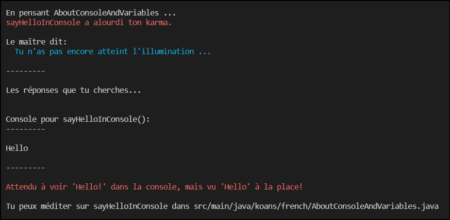


Oups, nous avons fait une erreur! Le maître s'attendait à ce que l'on affiche _Hello!_, mais nous avons oublié le point d'exclamation. Corrigeons ceci dans `src/main/java/koans/french/AboutConsoleAndVariables.java`:

```java
    public static void sayHelloInConsole() {
        System.out.println("Hello!");
    }
```

Et exécutons les koans de nouveau:

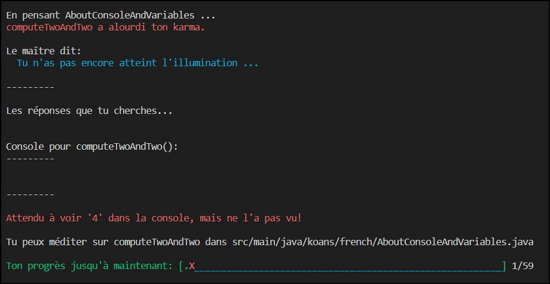


C'est un message différent cette fois! C'est parce que nous avons complété avec succès le premier koan! Le maître nous parle de notre progrès et du prochain koan.

Félicitations! Tu as complété ton premier koan! Tu peux maintenant regarder le koan suivant dans `src/main/java/koans/french/AboutConsoleAndVariables.java` et essayer de trouver comment le compléter.

## Aide mémoire Java

Pour t'aider à retenir les morceaux de syntaxe Java que tu apprends en complétant tes koans, tu peux imprimer une copie de l'[Aide mémoire Java](./AideMémoireJava.pdf).

## Et ensuite?

Une fois avoir complété les koans, tu es prêt·e pour apprendre à programmer un vrai robot. Mykah, de [l'équipe 9153 - Bearcat Robotics](https://sites.google.com/lincolnschoolscb.org/9153-bearcat-robotics/home), entretient [un excellent recueil de ressources pour la programmation FRC](https://docs.google.com/document/d/1jcBLAyJ3iTbsYSnWMVWqHaK8uywGTaTjF98eY_xxpl0/edit#heading=h.21bclvyus8vm). Tu pourras sûrement y trouver tes prochains apprentissages.

<br/>

> Expérience est le nom que les gens donnent aux erreurs qu'ils ont faites.

*Oscar Wilde*

<a name="mentors-fr"></a>
## Mentors

Ce cours se veut fournir toute l'information nécessaire pour qu'un élève motivé puisse apprendre le Java sans aucune autre ressource à sa disposition. Cependant, l'expérience est bien meilleure avec l'assistance de mentors.

Nous avons trouvé que les élèves passent à travers le cours plus rapidement, et intègrent mieux les notions si le ou la mentor ne lui donne pas de solution à ses problèmes. À la place, le ou la mentor peut garder l'élève dans une posture active en lui demandant ce qu'iel ne comprend pas dans l'énoncé de l'exercice, ou du message d'erreur, et le / la guider dans des stratégies pour comprendre par iel même. La programmation consiste, la plupart du temps, à trouver quel petit détail nous avons oublié. En aidant les élèves à trouver les ressources pour résoudre les problèmes eux-même, ils deviennent au final autonomes plus rapidement lorsqu'ils débogueront un programme de robot.

Si vous êtes intéressés à contribuer à ce cours, rendez-vous sur la page [CONTRIBUTING.md](CONTRIBUTING.md) :)

## Attributions et remerciements

Créé par un mentor de [l'équipe 3550 Robotronix](https://www.instagram.com/3550robotronix/) (Montréal, Canada).

Grandement inspiré par les merveilleux [Ruby Koans](https://www.rubykoans.com/).

Grand merci aux premiers testeurs qui ont donné leur avis: Andy, Noémie, Chenxin, et Dumitru.

<a name="license-fr"></a>
## License

 Cette oeuvre est disponible sous une license [Attribution - Partage dans les Mêmes Conditions 4.0 International](https://creativecommons.org/licenses/by-sa/4.0/deed.fr).
